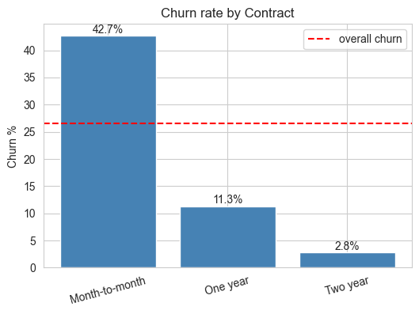
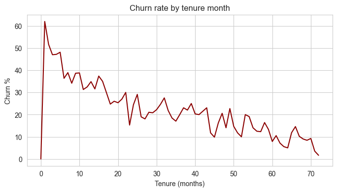
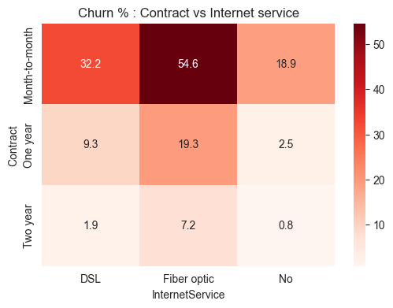
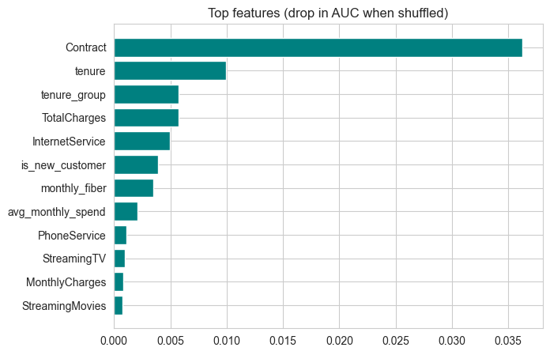
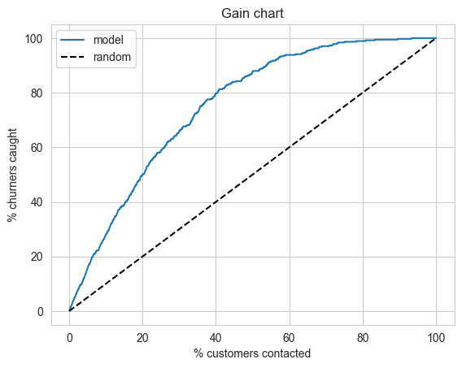

# Telecom Customer Churn Analysis

Data analysis project to find why telecom customers leave, how much revenue is at risk, and who to target with retention offers.

**Tools:** Python (pandas, scipy, scikit-learn), SQL (SQLite), Matplotlib, Seaborn

## Business Problem
A telecom company is losing about 1 in 4 customers. Leadership wants to know:
1. Who is leaving, and why?
2. How much revenue is at risk?
3. Which customers should get retention offers first?

## Dataset
IBM Telco Customer Churn: 7,043 customers, 21 columns (demographics, services, contract, billing, churn).

## Key Findings
- **26.54% of customers churned** (1,869 of 7,043), costing **139,131 in monthly revenue (30.5% of the total)**.
- **Contract is the biggest driver.** Month-to-month churn is 42.7% vs 2.8% for two-year contracts, and month-to-month customers account for about 87% of lost revenue.
- **The first year is the riskiest.** Churn is 47.4% in months 0-12 and only 9.5% after 49 months.
- **Fiber optic (41.9%) and electronic check (45.3%)** customers churn far more than others.
- **Tech support and online security** customers churn about half as much (about 15% vs 31%).
- **Seniors (41.7%) and single customers (33.0%)** churn more. Gender has no significant effect.
- **High-risk segment:** month-to-month + fiber + first year + no tech support. It is 11.8% of customers, has a 71.1% churn rate and holds 31.7% of all churn.





## Approach
1. **Data cleaning:** fixed `TotalCharges` (text with 11 blanks, all new customers), merged redundant categories, checked duplicates and billing consistency ([data quality log](reports/data_quality_log.md)).
2. **KPIs and EDA:** churn rate, revenue at risk, and hypothesis-driven analysis of contract, tenure, services, payment and demographics.
3. **Statistical tests:** chi-square with Cramér's V for categorical variables, Mann-Whitney for tenure and charges.
4. **SQL:** the same KPIs in SQLite using CASE, CTEs and window functions.
5. **Feature engineering:** 10+ features such as service count, tenure groups, price change and risk combinations.
6. **Modeling:** leakage-free scikit-learn pipeline, 5-fold cross-validation, class weights for imbalance.
7. **Business impact:** threshold selection using offer cost and expected savings, plus a lift analysis.

## Model Results
| Model | Test ROC-AUC | Recall (churners) | Precision |
|---|---|---|---|
| Logistic Regression | 0.844 | 0.797 | 0.505 |
| Random Forest | 0.845 | 0.775 | 0.544 |
| Gradient Boosting | 0.843 | 0.521 | 0.657 |

- All three models perform almost the same (cross-validated AUC about 0.85), and feature engineering added only about 0.002 AUC.
- **Contract** is the most important feature, followed by tenure.
- **The top 20% of customers ranked by risk contain 50% of all churners (2.5x lift).**




## Recommendations
1. **Offer annual-contract discounts** to month-to-month customers (about 87% of lost revenue).
2. **Give new fiber customers free tech support or security** in their first year.
3. **Run an onboarding campaign for the first 3 months,** when churn is highest.
4. **Move electronic check customers to auto-pay** with a small incentive.
5. **Send retention offers to the top 20% of customers by model risk score.**

## Repository Structure
```
├── images/                      charts used in the analysis
├── reports/
│   ├── final_insights.md        full findings and recommendations
│   ├── data_quality_log.md      data issues and how they were handled
│   └── high_risk_customers.csv  customers ranked by churn risk
├── data_processedn.csv          cleaned dataset
├── telco_churn_analysis.ipynb   full analysis notebook
└── requirements.txt
```

## How to Run
```bash
pip install -r requirements.txt
```
Place the original CSV in the project folder and run the notebook from top to bottom.

## Limitations
- The dataset is a snapshot with no dates, so time trends can't be analyzed.
- Results show correlation, not causation; retention offers should be A/B tested.
- Offer cost and success rate used in the business-impact step are assumptions.
